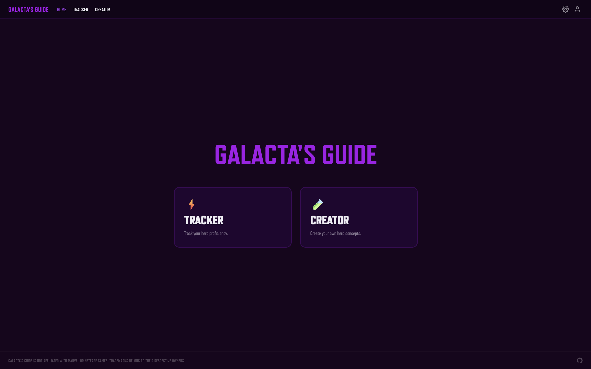

<div align="center">


# Galacta's Guide

A Marvel Rivals proficiency tracker and hero creator.

</div>

## Preview



## Features

- Track hero proficiency using rank, level, and points
- Create hero concepts and integrate into the tracker
- Customize with themes and card backgrounds
- localStorage persistence with export, import, and clear

## Usage

The easiest way is the live site: **[https://johnarp.github.io/galactas-guide](https://johnarp.github.io/galactas-guide)**

Alternatively, run it locally with any static server (eg. Python):

```bash
git clone https://github.com/johnarp/galactas-guide.git
cd galactas-guide
python -m http.server 3000
```

Then open in your browser: **[http://localhost:3000](http://localhost:3000)**

## Known Issues

- Multi-role Heroes (eg. Deadpool) show only their first role's color in Role card background mode

## To Do

- General
    - Site icon
    - HTML meta tags
    - GitHub Social preview
    - Improve README banner
    - Lord and Champion icons
    - Rename images with generic names
- Home
    - Dynamic version number in footer
        - Click version to open pop-up changelog
    - Newest hero displayed on home screen
- Tracker
    - Heroes pop-out when hovering
    - Customize heroes with skins
        - Skin rarity card background
        - Option to disable hover image
    - Change size of hero cards
    - Exclude-favorites and exclude-created filters
- Creator
    - Upload custom images
    - Allow adding hero abilities and season released
- Profile
    - Hero nameplate
    - Display a hero and its info on your profile

## License

Source code is licensed under the [MIT License](./LICENSE)

## Legal

Marvel Rivals assets, images, and related media included in this project are the property of NetEase Games and/or Marvel and are not covered by the [MIT License](./LICENSE). This project is not affiliated with or endorsed by NetEase or Marvel.