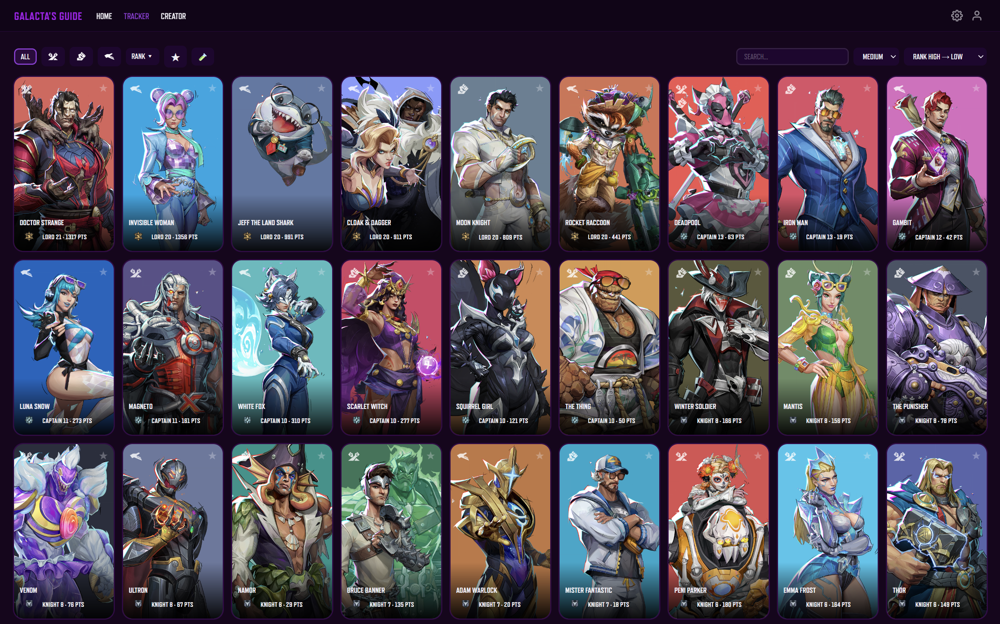
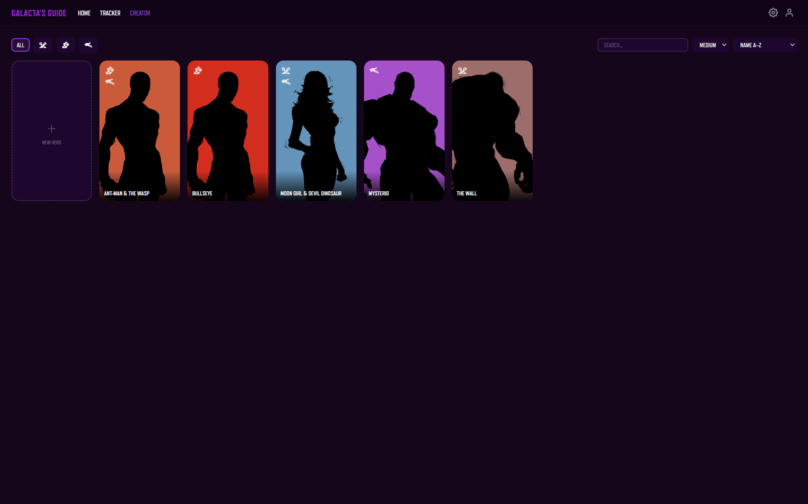

<div align="center">


# Galacta's Guide

A Marvel Rivals proficiency tracker and hero creator.

[](./LICENSE)


</div>

## ✨ Features

- Track hero proficiency using rank, level, and points
- Create hero concepts and add them into the tracker
- Customize with view modes, themes, card backgrounds, and more
- localStorage persistence with export, import, and clear

## 📸 Preview

<div style="display: flex; gap: 10px; justify-content: center">
    
    
</div>

## 🚀 Installation

The easiest way to access is going to the website: [https://johnarp.github.io/galactas-guide/](https://johnarp.github.io/galactas-guide/)

Or, if you wish to use locally, here are the steps:

### 1. Downloading the Code

Clone the repository through a terminal, such as Command Prompt or Powershell:

```
git clone https://github.com/johnarp/galactas-guide
cd galactas-guide
```

### 2. Running the App

Run the command:

```
python -m http.server 3000
```

### 3. Using the App

Open [http://localhost:3000](http://localhost:3000) in a web browser.

## ⚠️ Known Issues

- Multi-role Heroes only show the color of their first role while using the Role card background
- Role filter images remain white in Rivals theme
- Hela's hover image is cut off
- Icons are of varying quality
- Icon changing through the proficiency modal requires exiting and opening again to see in the modal
- To apply icon or costume change, the proficiency modal can only be closed, not saved
- There are no Lord/Champion icons for costumes
- There is no visible difference between icon sizes on mobile
- Large and medium cards on mobile are too large (one per row)

## 🗺️ Roadmap

### General

- Champion icons
- (WIP) Rename hero images with generic names

### Home

- Dynamic version number in footer
    - Click to open pop-up changelog
- Display newest hero on home screen
- Source Code and Report Issue links

### Tracker

- Heroes pop-out when hovering
- Change color and shape of favorite button

### Creator

- Icons
- Upload custom images
- Set a difficulty

### Settings

- More options for Show Proficiency
- Show/Hide hero role icon
- Option to disable Lord/Champion icons
- Better organization

### Profile

- Hero nameplate
- Display a hero and its info on your profile

## 📄 License

This project is licensed under the [MIT License](./LICENSE).

## ⚖️ Legal

Galacta's Guide is an unofficial project and is not affiliated with, endorsed by, or associated with NetEase games or Marvel in any way.

Marvel Rivals assets, images, and related media included in this project are the property of NetEase Games and/or Marvel and are not covered by the MIT License.